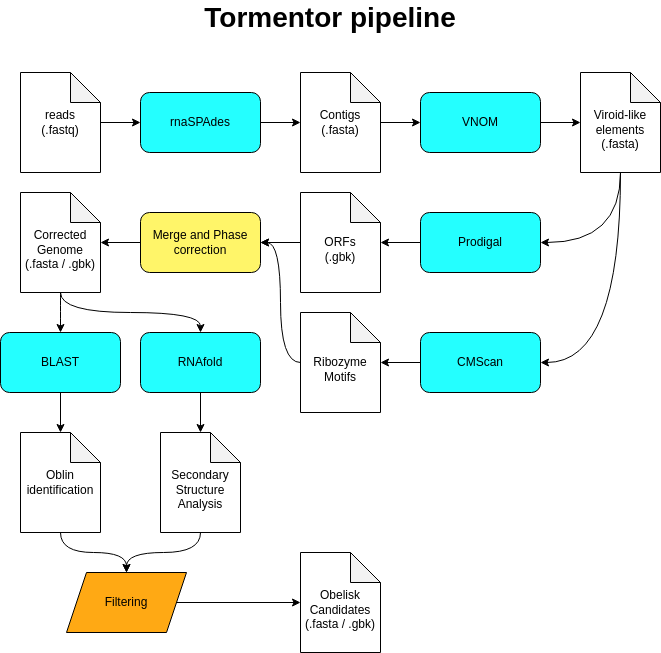

# Tormentor

An [obelisk](https://www.biorxiv.org/content/10.1101/2024.01.20.576352v1.full.pdf) prediction and annotation pipeline


**WARNING: this tool is still under development!**

## Setup

Configuring Tormentor requires `conda` (anaconda/miniconda/miniforge). After installation 
an environment named `tormentor` will be created.

```bash
(base) $ git clone git@github.com:/omixlab/tormentor
(base) $ cd tormentor
(base) $ make setup
(base) $ conda activate tormentor
```

## Pipeline



The pipeline was implements using the Python programming language version 3.8. Raw RNA-Seq reads as processed and trimmed using FASTP and assembled using rnaSPAdes, followed by an identification of viroid-like elements using VNOM. Circular elements with length between 900 and 2000 are keep and analyzed using Prodigal for ORF annotation and adjust of the sequence phase based on the start position of the largest ORF. Obelisks-related ribozyme motifs are annotated using cmscan from the INFERNAL package using the covariance models created by the original team, and secondary structures and predicted using RNAFold. Only sequences containing ORFs and an secondary structure composed by at least 90% of self-pairing regions are considered potential obelisks. 

## Running

```bash
(tormentor) $ tormentor --reads reads_1.fastq reads_2.fastq --output results/ --threads 4
```

## Results

Results are provided in FASTA (nucleotide and protein) and GenBank format, along with
intermediate results from each program used in the pipeline.

## The name

The name is a reference to *Obelisk the Tormentor*, a card from the trading card game / anime / mangá "Yu-Gi-Oh!". 

# Cite us

Kremer, F (2024). *Tormentor: An obelisk prediction and annotation pipeline*.
